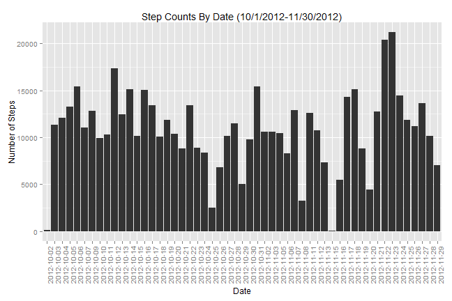
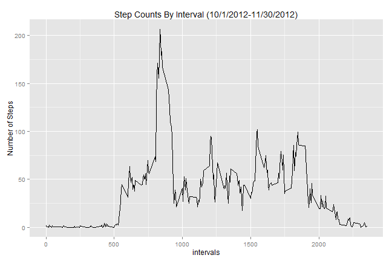
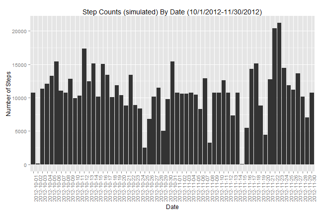
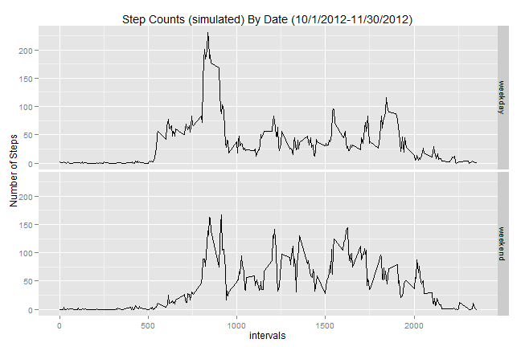

# Reproducible Research: Peer Assessment 1
# Activity Analysis of steps taken for period (10/1/2012 - 11/30/2012)
========================================================

## Loading and preprocessing the data

```r
dataDir <- "data"
localZipFileName <- paste(dataDir,"activity.zip",sep="/")  
localFileName <- paste(dataDir,"activity.csv",sep="/")  

if (!file.exists(dataDir)) {
  dir.create(dataDir)
  
  setInternet2(TRUE)  # set the R_WIN_INTERNET2 to TRUE  
  zipFileUrl <- "https://d396qusza40orc.cloudfront.net/repdata/data/activity.zip"
  download.file(zipFileUrl,localZipFileName)
  dateDownloaded <- date()
  dateDownloaded
  
  ##unzip the file
  library(utils)
  unzip(localZipFileName,exdir=dataDir)
}

#Set default date format to the format of the dates in the file
library(Defaults)
setDefaults('as.Date.character', format = '%Y-%m-%d')

steps.data <- read.csv(localFileName,header=TRUE,colClasses=c("numeric","Date","numeric"))
steps.data$date <- factor(steps.data$date)
```
## What is mean total number of steps taken per day?

### Ignore missing values

```r
steps.data.cc <- steps.data[complete.cases(steps.data),]
```

### Make a histogram of the total number of steps taken each day

```r
#Create dataframe of frequency counts of steps by date
daily.freq <- aggregate(
                list(steps=steps.data.cc$steps), 
                by=list(date=steps.data.cc$date),
                FUN=sum
              )

#Create bar plot of steps by date
library(ggplot2)
datep <- ggplot(data=daily.freq ,aes(x = date, y = steps))
datep <- datep + geom_bar(stat = "identity", position = "stack") 
datep <- datep + theme(axis.text.x = element_text(angle = 90, hjust = 1))
datep <- datep + labs(x = "Date", y="Number of Steps",title = "Step Counts By Date (10/1/2012-11/30/2012)")
print(datep)
```

 

### Calculate and report the mean and median total number of steps taken per day

```r
steps.mean <- mean(daily.freq$steps)
steps.median <- median(daily.freq$steps)
steps.mean
```

```
## [1] 10766
```

```r
steps.median
```

```
## [1] 10765
```

## What is the average daily activity pattern?

### Make a time series plot (i.e. type = "l") of the 5-minute interval (x-axis) and the average  number of steps taken, averaged across all days (y-axis)

```r
#Create dataframe of average count of steps for each interval
intv.mean <- aggregate(list(steps=steps.data.cc$steps),
                by=list(interval=steps.data.cc$interval), FUN=mean)

intvp <- ggplot(intv.mean, aes(x=interval, y=steps)) +
  geom_line() + 
  scale_x_continuous("intervals")

intvp <- intvp + labs(
    x = "Interval",
    y="Number of Steps",
    title = "Step Counts By Interval (10/1/2012-11/30/2012)"
)

print(intvp)
```

 

### Which 5-minute interval, on average across all the days in the dataset, contains the maximum  number of steps?

```r
max.intv <- intv.mean[which.max(intv.mean$steps),"interval"]
max.intv
```

```
## [1] 835
```

## Imputing missing values

### Calculate and report the total number of missing values in the dataset (i.e. the total number  of rows with NAs)

```r
missing.count <- nrow(steps.data[!complete.cases(steps.data),])
missing.count
```

```
## [1] 2304
```

### Devise a strategy for filling in all of the missing values in the dataset. 
### The strategy used will be to use the average step count for each 5 minute interva

```r
#Merge the step.data dataset with the average step count for each 5 minute interval so we can 
#deal with NAs
steps.data.sim <- merge(steps.data,intv.mean,by="interval")
names(steps.data.sim) <- c("interval","actual_steps","date","simulated_steps")
```

### Create a new dataset that is equal to the original dataset but with the missing data filled  in.

```r
#Assign the actual step count to the simulated step count if not NA
steps.data.sim[complete.cases(steps.data.sim),"simulated_steps"] = steps.data.sim[complete.cases(steps.data.sim),"actual_steps"]

#drop the actual column
steps.data.sim <- steps.data.sim[,c("interval","date","simulated_steps")]
names(steps.data.sim) <- c("interval","date","steps")
```

### Make a histogram of the total number of steps taken each day and Calculate and report the 
### mean and median total number of steps taken per day. Do these values differ from the estimates from the first part of the assignment? What is the impact of imputing missing data on the estimates of the total daily number of steps?


```r
#Create dataframe of frequency counts of steps by date
daily.freq.sim <- aggregate(list(steps=steps.data.sim$steps), by=list(date=steps.data.sim$date), FUN=sum)

simp <- ggplot(data=daily.freq.sim ,aes(x = date, y = steps))
simp <- simp + geom_bar(stat = "identity", position = "stack") 
simp <- simp + theme(axis.text.x = element_text(angle = 90, hjust = 1))
simp <- simp + labs(
  x = "Date",
  y="Number of Steps",
  title = "Step Counts (simulated) By Date (10/1/2012-11/30/2012)"
)

print(simp)
```

 

```r
steps.mean.sim <- mean(daily.freq.sim$steps)
steps.median.sim <- median(daily.freq.sim$steps)
steps.mean.sim
```

```
## [1] 10766
```

```r
steps.median.sim
```

```
## [1] 10766
```

### The mean and median did not change appreciably by simulating missing values

## Are there differences in activity patterns between weekdays and weekends?

### Create a new factor variable in the dataset with two levels - "weekday" and "weekend" indicating whether a given date is a weekday or weekend day.

```r
steps.data.sim$day_type <- 
  as.factor(ifelse(weekdays(as.Date(as.character(steps.data.sim$date))) 
  %in% c("Saturday","Sunday"), "weekend", "weekday"))
```

### Make a panel plot containing a time series plot (i.e. type = "l") of the 5-minute interval (x-axis) and the average number of steps taken, averaged across all weekday days or weekend days (y-axis).

```r
#Create dataframe of average counts of steps by interval and day_type
intv.mean.day <- 
  aggregate(
    list(steps=steps.data.sim$steps)
    ,by=list(interval=steps.data.sim$interval,day_type=steps.data.sim$day_type)
    ,FUN=mean
  )

day.plot <- ggplot(intv.mean.day, aes(x=interval, y=steps)) + geom_line() + scale_x_continuous("intervals")

day.plot <- day.plot + labs(x = "Interval", y="Number of Steps",title = "Step Counts (simulated) By Date (10/1/2012-11/30/2012)")

day.plot <- day.plot + facet_grid(day_type ~ .)

print(day.plot)
```

 

### There are small differences in the activity patterns between weekdays and weekends
